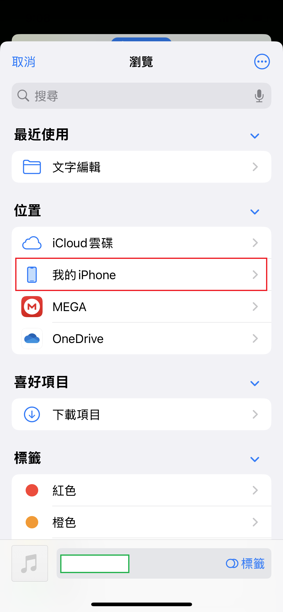

# iphone鈴聲製作

iphone 的鈴聲製作有夠煩燥，每次都要用 iTunes 或者其他軟體來製作，還要轉換格式，實在是太麻煩了
所以這裡提供一個簡單的方法，使用 iPhone 內建的 GarageBand 應用程式來製作鈴聲。

## 1. 下載音樂

下載音樂到電腦上，格式可以是 MP3、M4A 等。

## 2. 把音樂上傳到iphone上

別使用什麼垃圾 iTunes 傳檔了，用個什麼聊天軟體都行，直接發給自己就行了。

例如傳到 Telegram/LINE，然後在 Telegram/LINE 中長按音樂文件，選擇「分享」，然後選擇「儲存到檔案」。

然後選擇「儲存到我的 iPhone」，點擊「儲存」。

## 3. 打開「檔案」App

在 iPhone 上找到「檔案」App，然後打開它。
在「檔案」App 中，看看有沒有剛才儲存的音樂文件，通常會在「我的 iPhone」或「iCloud Drive」中。

確定檔案存在後，接著打開內建的 GarageBand 應用程式。

## 4. 打開 GarageBand

在 GarageBand 中，點擊「+」製作歌取按鈕來創建一個新的項目。

點選錄音機圖示，然後選擇「音頻錄音」。

切換到音軌視圖，然後點擊左上角的「瀏覽」按鈕。

## 5. 將音樂導入 GarageBand

點選右上角的「瀏覽」按鈕，然後選擇「檔案」。

選擇到「我的 iPhone」或「iCloud Drive」，找到剛才儲存的音樂文件。
點擊並按住音樂文件，然後拖動到 GarageBand 的音軌上。

## 6. 剪輯音樂
在 GarageBand 中，你可以使用剪輯工具來調整音樂的長度。
選擇音軌，然後使用剪輯工具來裁剪音樂到你想要的長度。
如果你想要將音樂設置為鈴聲，通常需要將其長度限制在 30 秒以內。
如果音樂超過 30 秒，請使用剪輯工具將其裁剪到 30 秒以內。

## 7. 將音樂導出為鈴聲
點擊左上角的「我的歌曲」按鈕，然後選擇「分享」。

選擇「鈴聲」。

輸入鈴聲的名稱，然後點擊「導出」。

## 8. 設置鈴聲
導出完成後，會提示你是否要使用這個鈴聲。
點擊「使用鈴聲」。
如果沒有提示，可以在「設定」->「聲音與觸感」->「鈴聲」中找到剛才導出的鈴聲，然後選擇它。

## 9. 完成
現在你已經成功製作了自己的 iPhone 鈴聲，可以在「設定」中設置它為鈴聲了。